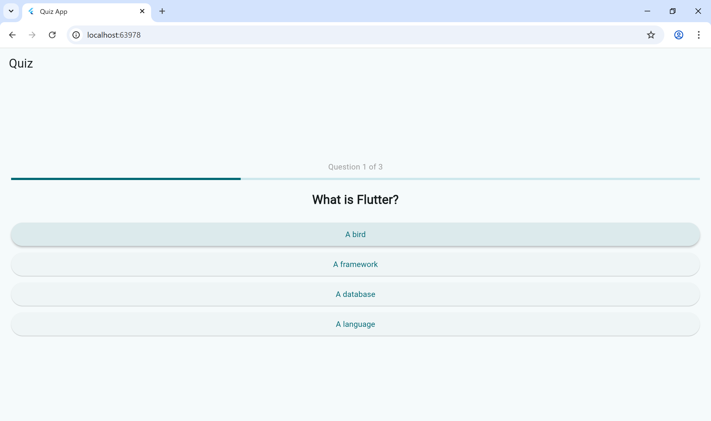
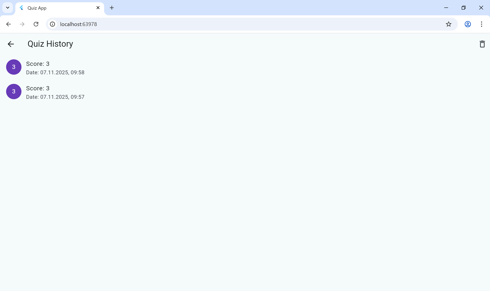

# Quiz App

**Коротко:**  
Quiz App — простий квіз-застосунок на Flutter з архітектурою OOP + clean layers. Підтримує:
- Покрокові питання з анімаціями між ними.
- Підрахунок балів та екран результатів з підсвічуванням правильних/неправильних відповідей.
- Історія результатів (збереження локально через SharedPreferences).
- Чистий код із Riverpod для стану.

---

## Скриншоти




---

## Структура проєкту
```
lib/
 ├─ main.dart
 ├─ core/
 │   └─ services/
 │       └─ local_storage_service.dart
 ├─ data/
 │   ├─ models/
 │   ├─ sources/
 │   └─ repositories/
 ├─ domain/
 │   └─ entities/
 └─ presentation/
     ├─ providers/
     └─ screens/
```

Кожен шар відповідає за свою відповідальність (Single Responsibility). Репозиторій інкапсулює доступ до джерел даних.

---

## Як запустити
Потреби:
- Flutter SDK (>= 3.0)
- Android Studio або VS Code

Кроки:
1. Клонувати репозиторій або розпакувати архів.
2. В терміналі у корені проєкту виконати:
```bash
flutter pub get
flutter run
```

---

## Залежності
- `flutter_riverpod` — для управління станом.
- `shared_preferences` — локальне збереження результатів.
- `intl` — форматування дати.

